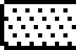

# Diagnostic Keyboard Check

This slice expands `DC98:0CA2`, reached by the diagnostic monitor `K` command in
[`diagnostic-monitor.md`](diagnostic-monitor.md). It bottoms out the keyboard
check itself: the remaining calls are the already documented display-stream
wrapper `C000:67AD`, the normal keyboard-input helper `C000:08A3`, and local
bitmap-resource emitters.

No string resources are reached here. The screen is built from `FF 40`, `FF 42`,
and `FF 44` display records and ROM bitmap assets.

## Entry

`DC98` maps to file offset `0x5C980 + offset`; `DC98:0CA2` is file `0x5D622`.

The routine allocates a 64-byte stack bitmap, clears each visible key cell,
draws the static keyboard frame and footer, then waits until every valid
keyboard event number `1..64` has appeared once.

```asm
diagnostic_keyboard_check_DC98_0CA2:
; file 0x5D622
DC98:0CA2  55                push bp
DC98:0CA3  8B EC             mov  bp,sp
DC98:0CA5  83 EC 40          sub  sp,0x40
DC98:0CA8  51                push cx
DC98:0CA9  56                push si
DC98:0CAA  9A 70 0E 98 DC    call DC98:0E70       ; emit EDFA:0002 setup stream
DC98:0CAF  33 F6             xor  si,si

clear_next_key_cell:
DC98:0CB3  8B C6             mov  ax,si
DC98:0CB5  E8 7F F4          call DC98:0137       ; draw unpressed key cell
DC98:0CB8  C6 42 C0 00       mov  byte [bp+si-0x40],0
DC98:0CBC  46                inc  si
DC98:0CBD  83 FE 40          cmp  si,0x40
DC98:0CC0  7C F1             jl   clear_next_key_cell

DC98:0CC2  E8 99 F8          call DC98:055E       ; static keyboard grid
DC98:0CC5  E8 D7 FC          call DC98:099F       ; footer/legend block
DC98:0CC8  33 C9             xor  cx,cx           ; count of distinct keys seen

poll_key:
DC98:0CCC  9A 96 16 00 C0    call C000:1696       ; AX = key/event number
DC98:0CD1  8B F0             mov  si,ax
DC98:0CD3  4E                dec  si              ; convert 1..64 to 0..63
DC98:0CD4  83 FE 00          cmp  si,0
DC98:0CD7  7C 15             jl   poll_continue
DC98:0CD9  83 FE 3F          cmp  si,0x3f
DC98:0CDC  7F 10             jg   poll_continue
DC98:0CDE  80 7A C0 00       cmp  byte [bp+si-0x40],0
DC98:0CE2  75 0A             jnz  poll_continue
DC98:0CE4  C6 42 C0 01       mov  byte [bp+si-0x40],1
DC98:0CE8  8B C6             mov  ax,si
DC98:0CEA  E8 C1 F5          call DC98:02AE       ; draw pressed key marker
DC98:0CED  41                inc  cx

poll_continue:
DC98:0CEE  83 F9 40          cmp  cx,0x40
DC98:0CF1  75 D9             jnz  poll_key
DC98:0CF3  5E                pop  si
DC98:0CF4  59                pop  cx
DC98:0CF5  8B E5             mov  sp,bp
DC98:0CF7  5D                pop  bp
DC98:0CF8  CB                retf
```

The input boundary is a narrow far wrapper around the shared keyboard reader:

```asm
diagnostic_key_input_C000_1696:
; file 0x41696
C000:1696  51                push cx
C000:1697  52                push dx
C000:1698  56                push si
C000:1699  57                push di
C000:169A  55                push bp
C000:169B  E8 05 F2          call C000:08A3
C000:169E  32 E4             xor  ah,ah
C000:16A0  5D                pop  bp
C000:16A1  5F                pop  di
C000:16A2  5E                pop  si
C000:16A3  5A                pop  dx
C000:16A4  59                pop  cx
C000:16A5  CB                retf
```

## Key Table

The key-position table is `EE2F:000C`, file `0x6E2FC`. Each of the 64 records is
six bytes:

```text
u8  key_class
u8  x
u16 y
u16 matrix_position
```

`x` and `y` are the display position used by the key-cell drawing helpers.
`matrix_position` is not the returned event number. `DC98:02AE` splits it into
two nibbles to draw the small matrix marker:

```text
marker_x = ((matrix_position >> 4) * 7) + 1
marker_y = ((matrix_position & 0x0F) * 12) + 0xED
```

The event number returned by `C000:1696` selects the record by `event - 1`.
Duplicate events are ignored by the stack bitmap.

## Drawing Helpers

Helper entry map:

| Entry | File | Return | Role |
| --- | ---: | --- | --- |
| `DC98:0137` | `0x5CAB7` | near `ret` | Draw one unpressed key cell for `AX=index`. |
| `DC98:02AE` | `0x5CC2E` | near `ret` | Draw one newly pressed key marker for `AX=index`. |
| `DC98:055E` | `0x5CEDE` | near `ret` | Draw static keyboard grid, row/column guides, and per-cell markers. |
| `DC98:099F` | `0x5D31F` | near `ret` | Draw footer/title legend and lower digit rows. |
| `DC98:0E70` | `0x5D7F0` | far `retf` | Emit the fixed display setup stream. |

All five helpers ultimately submit stack-built or ROM-backed display streams
through `C000:67AD`; none calls back into the diagnostic parser or into an
application handler.

`DC98:0E70` emits a fixed 15-byte setup stream from `EDFA:0002` through
`C000:67AD`. This is a display control stream, not a string.

```asm
diagnostic_keyboard_setup_DC98_0E70:
; file 0x5D7F0
DC98:0E70  51                push cx
DC98:0E71  B8 02 00          mov  ax,0x0002
DC98:0E74  BB FA ED          mov  bx,0xedfa
DC98:0E77  B9 0F 00          mov  cx,0x000f
DC98:0E7A  9A AD 67 00 C0    call C000:67AD
DC98:0E7F  59                pop  cx
DC98:0E80  CB                retf
```

`DC98:0137` builds a stack display stream for one unpressed key cell. It uses
`EE2F:000C + index*6` for position/class, and uses class-specific source
geometry from `EE2C`. Class `8` has a special path that emits:

```text
FF 40 <x> <y>
FF 42 19 00 13 00 0A 00 11 EE
```

That blits the 25-row by 19-bit key asset at `EE11:000A`.

`DC98:02AE` marks a newly pressed key. It first redraws a small filled rectangle
over the key, then draws the class-specific marker glyph and the matrix marker
derived from the table's `matrix_position` word. Class `8` receives an extra
`13x13` fill at `x+0x0B,y+0x05`.

`DC98:055E` draws the static keyboard grid. Its loops:

- draw eight vertical guide/legend columns using 5-row glyphs at `EE17:000C +
  index*5`;
- draw ten horizontal guide/legend rows using the same digit glyph strip;
- walk all 64 `EE2F` records and place the small `EE16:0006` marker at each
  matrix coordinate;
- draw two lower labels from `EE16:000C` and `EE17:0002`.

`DC98:099F` draws the footer/legend block. It emits the larger title/legend
bitmap at `EE1A:000E`, then two rows of digit glyphs selected by bytes in
`EE2B`, followed by two small labels from `EE16:000C` and `EE17:0002`.

## Bitmap Assets

The table below lists the concrete bitmap resources reached by this path.
Dimensions are the `FF 42` dimensions as consumed by the display parser.

| Resource | File | Dimensions | Render |
| --- | ---: | --- | --- |
| Keycap class 0 | `0x6DFCA` | `12x12` |  |
| Keycap class 1 | `0x6DFE2` | `12x12` |  |
| Keycap class 2 | `0x6E00A` | `12x12` |  |
| Keycap class 3 | `0x6E01E` | `18x12` |  |
| Keycap class 4 | `0x6E042` | `22x12` |  |
| Keycap class 5 | `0x6E072` | `25x12` |  |
| Keycap class 6 | `0x6E0A2` | `28x12` |  |
| Wide keycap class 7 | `0x6E11A` | `77x12` |  |
| Special keycap class 8 | `0x6E11A` | `19x25` |  |
| Pressed-key marker | `0x6E166` | `5x5` |  |
| Small lower label | `0x6E16C` | `8x5` |  |
| Wide lower label | `0x6E172` | `12x5` |  |
| Digit glyph strip | `0x6E17C` | ten `4x5` glyphs, rendered as `4x50` |  |
| Footer/title legend | `0x6E1AE` | `102x20` |  |

## Bottom

This root does not install interrupt vectors, call the diagnostic monitor
parser, or branch into application handlers. Its only live loop is the 64-key
coverage wait. Once all 64 event numbers have been observed, it returns to
`C000:16A6`, which restores diagnostic flag `[6D51] bit 0` and redraws the
monitor banner.
