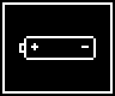

# Foreground Idle And Battery Warnings

This slice follows foreground idle helpers reached from `INT 21h` keyboard,
serial, and printer services, plus the battery-warning overlay they call while
waiting. It connects the installed `F8h` power IRQ in
[`power-irq.md`](power-irq.md) to the foreground code that consumes the retained
resume request.

## Retained Power Request

`C000:4961` checks whether the foreground should enter the retained-power path.
The marker `[6809]=1992` is written by the power IRQ path; if `[680D]` is clear
and the marker is present, the helper returns carry set.

```asm
retained_request_C000_4961:
; file 0x44961
C000:4961  80 3E 0D 68 00    cmp  byte [0x680d],0
C000:4966  75 ...            jnz  no_retained_request
C000:4968  81 3E 09 68 C8 07 cmp  word [0x6809],0x07c8
...
C000:4973  F9                stc
C000:4974  C3                ret
```

## Idle Until Event

`C000:49F8` is the common wait helper used by keyboard read, serial output, and
printer output. It polls main-battery status, checks the retained request, tests
the keyboard/event queue, services serial receive state, and may enter retained
power through one of the saved-resume target helpers.

```asm
idle_until_event_C000_49F8:
; file 0x449F8
C000:49F8  E8 98 C0          call main_battery_low_C000_0A93
C000:49FB  E8 63 FF          call retained_request_C000_4961
...
C000:4A25  ...               ; save resume target C000:49FD
C000:4A34  ...               ; save resume target C000:4977
C000:4A43  ...               ; save resume target C000:4A8D
...
C000:4A84  A0 4F 6D          mov  al,[0x6d4f]
C000:4A87  E6 60             out  0x60,al
C000:4A89  FB                sti
C000:4A8A  F4                hlt
```

`C000:4A25`, `C000:4A34`, and `C000:4A43` save CPU state into the `6D65..`
retained-context area before the suspend handoff. The three entry points differ
only in the resume target they seed: idle wait, nonblocking status, or blocking
keyboard read.

## Battery Overlay

Blocking keyboard read calls `C000:4C91`, and the wait paths clear any active
overlay through `C000:4C39`. The overlay code saves a 48x40 screen rectangle,
draws one selected icon into framebuffer address `0x131B`, and later restores
the saved rectangle.

```asm
battery_warning_clear_C000_4C39:
; file 0x44C39
C000:4C39  ...               ; restore saved 48x40 screen area if active
C000:4C4C  C6 06 52 6D 00    mov  byte [0x6d52],0
C000:4C51  C3                ret

battery_warning_poll_C000_4C91:
; file 0x44C91
C000:4C91  ...               ; rotate slots 2, 3, 4 in [6D52]
C000:4CDC  C6 06 52 6D 02    mov  byte [0x6d52],2
C000:4CE6  E8 85 FF          call save_warning_area_C000_4C6E
C000:4CF0  E8 14 00          call draw_warning_icon_C000_4D07
```

### Battery Icon Assets

The draw routine selects `C000:4D30 + AL * 0xF0`, so each asset is 48x40 pixels
with 6 bytes per row. The PNGs below were rendered with
`tools/render_rom_bitmap_png.py`.

| Icon | ROM source | PNG |
| --- | --- | --- |
| Main battery low | `C000:4D30` / file `0x44D30` |  |
| CR2032 retention battery low | `C000:4E20` / file `0x44E20` |  |
| PCMCIA SRAM-card battery low | `C000:4F10` / file `0x44F10` |  |

## State Boundary

| RAM/Port | Meaning |
| ---: | --- |
| `6809` | Retained power marker; value `1992` is consumed by `C000:4961`. |
| `680B` | Foreground auto-off countdown, reloaded from `[6D31]`. |
| `680D` | Guard byte that suppresses the retained request when nonzero. |
| `6D31` | Auto-off reload value. |
| `6D52` | Battery-warning display state; bit `0x80` marks active overlay. |
| `6D65..` | Retained CPU-context save area. |
| `0x60` | Control mirror output before idle `hlt`. |

## Next Splits

| Root | Split | Reason |
| --- | --- | --- |
| `C000:0A6A`, `0A93`, `0AA4`, `0AB2` | `battery-status.md` | Port `0xA0` battery/card status polling. |
| `C000:0376`, `C000:0784`, `C000:0807` | [`rtc-alarm-power.md`](rtc-alarm-power.md) | RTC alarm re-arm and wake discriminator. |
