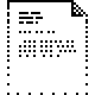
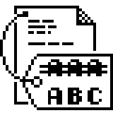
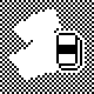
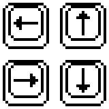
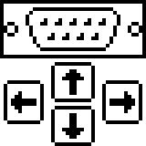
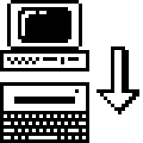
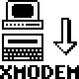
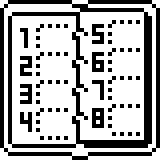
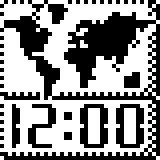

# Bitmap And UI Resource Tables

Bitmaps identified by tracing `DEF0:115C` (menu renderer) and all
callers of `C000:6557` / `C000:3F35` (display script renderer).

```sh
tools/render_rom_bitmap_png.py <offset> <width> <height> <output.png> \
    --rom v3.1/t4_ir_3.1_e588.ic303 --scale 4
```

## Menu Rendering Pipeline

`DEF0:115C` builds display scripts in RAM at `[18F1]` from menu
descriptor data, then renders via `C000:3F35`. For each menu item
it emits two `FF 42` bitmap blit commands:

1. **Small icon** (9×13, 2 bytes/row): hardcoded at DEF0:123F/124A.
   Source: segment `F007`, offset `0x0A + item * 0x1A`.

2. **Large icon** (40×40, 5 bytes/row): hardcoded at DEF0:12D2/12DD.
   Source: (offset, segment) pairs from the menu descriptor at
   `[ES:BX+4 + item*4]` (DEF0:12E5..12F6).

Dimensions are hardcoded in `DEF0:115C`, not stored in the descriptor.

## Menu Descriptor Format

Passed to `DEF0:115C` via `ES:BX` (where ES=caller's BX, BX=caller's AX).

```text
[ES:BX+0]: u16  type (0=full-screen, 1=left-half, 2=right-half)
[ES:BX+2]: u16  item_count
[ES:BX+4]: (u16 offset, u16 segment) × item_count  large icon sources
[ES:BX+4+4*N]: 13-byte null-padded label strings × item_count
```

## Startup Menu Bitmaps

From the display script at `C772:EFB0`, rendered during application
entry. Contains `FF 42` commands referencing a shared button outline
and two text labels.

| File offset | Source | Dimensions | Image |
| ---: | --- | --- | --- |
| `0xD673B` | `C772:F01B` | 36×34 |  |
| `0xD67E5` | `C772:F0C5` | 24×7 |  |
| `0xD67FA` | `C772:F0DA` | 24×7 |  |

## WP Main Menu (F175, AX=6, type=0, 6 items)

Called from `DEF0:2761`.

| File offset | Source | Menu item | Image |
| ---: | --- | --- | --- |
| `0xF0116` | `F011:0006` | EDIT TEXT |  |
| `0xF02A6` | `F011:0196` | FILE |  |
| `0xF036E` | `F011:025E` | CLEAR TEXT |  |
| `0xF01DE` | `F011:00CE` | PRINTER |  |
| `0xF1246` | `F124:0006` | T I M E |  |
| `0xF0F26` | `F011:0E16` | OTHERS |  |

## WP File Submenu (F17C, AX=6, type=1, 6 items)

Called from `DEF0:26B4`.

| File offset | Source | Menu item | Image |
| ---: | --- | --- | --- |
| `0xF05C6` | `F011:04B6` | RECALL |  |
| `0xF04FE` | `F011:03EE` | STORE |  |
| `0xF068E` | `F011:057E` | DELETE |  |
| `0xF0756` | `F011:0646` | RENAME |  |
| `0xF0D96` | `F011:0C86` | COPY |  |
| `0xF0E5E` | `F011:0D4E` | INITIALIZE |  |

## WP Printer Submenu (F183, AX=6, type=1, 3 items)

Called from `DEF0:25B7`.

| File offset | Source | Menu item | Image |
| ---: | --- | --- | --- |
| `0xF01DE` | `F011:00CE` | PRINT OUT |  |
| `0xF08E6` | `F011:07D6` | SET UP 1 |  |
| `0xF09AE` | `F011:089E` | SET UP 2 |  |

Note: PRINT OUT reuses the same icon as PRINTER in the main menu.

## WP Communicate Submenu (F18A, AX=6, type=2, 6 items)

Called from `DEF0:2612`.

| File offset | Source | Menu item | Image |
| ---: | --- | --- | --- |
| `0xF0B3E` | `F011:0A2E` | SEND FILE |  |
| `0xF0FEE` | `F011:0EDE` | SEND FILE (2) |  |
| `0xF0C06` | `F011:0AF6` | RECEIVE FILE |  |
| `0xF10B6` | `F011:0FA6` | RECEIVE FILE (2) |  |
| `0xF0CCE` | `F011:0BBE` | TERMINAL |  |
| `0xF09AE` | `F011:089E` | SET UP |  |

Note: SET UP reuses the SET UP 2 icon from the Printer submenu.

## WP Others Submenu (F132, AX=8, type=1, 4 items)

Called from `DEF0:2DF1`.

| File offset | Source | Menu item | Image |
| ---: | --- | --- | --- |
| `0xF0A76` | `F011:0966` | COMMUNICATE |  |
| `0xF08E6` | `F011:07D6` | SYSTEM |  |
| `0xF117E` | `F117:000E` | PREFERENCES |  |
| `0xF081E` | `F011:070E` | ROM CARD |  |

Note: SYSTEM reuses the SET UP 1 icon from the Printer submenu.

## Organizer Main Menu (F243, AX=0xE, type=0, 5 items)

Called from `DEF0:5C2E`.

| File offset | Source | Menu item | Image |
| ---: | --- | --- | --- |
| `0xF2056` | `F205:0006` | CALCULATOR |  |
| `0xF211E` | `F205:00CE` | CALENDAR |  |
| `0xF21E6` | `F205:0196` | SCHEDULER |  |
| `0xF22AE` | `F205:025E` | WORLD CLOCK |  |
| `0xF2376` | `F205:0326` | ADDRESS BOOK |  |

## Editor Status Icon

Rendered via `FF 42` at `C772:A68C`. Dimensions from the display
script command: `height=0x18, width=0x0C`.

| File offset | Source | Dimensions | Image |
| ---: | --- | --- | --- |
| `0xD1978` | `C772:A258` | 12×24 |  |

## Small Menu Selection Icons (9×13)

Source at segment `F007`, offset `0x0A + item * 0x1A` (26 bytes each,
2 bytes/row × 13 rows). Rendered by `DEF0:115C` first bitmap loop
(DEF0:1236..1266). Six for WP menu, five for organizer.

| File offset | Source | Index |
| ---: | --- | ---: |
| `0xF007A` | `F007:000A` | 0 |
| `0xF0094` | `F007:0024` | 1 |
| `0xF00AE` | `F007:003E` | 2 |
| `0xF00C8` | `F007:0058` | 3 |
| `0xF00E2` | `F007:0072` | 4 |
| `0xF00FC` | `F007:008C` | 5 |

## Glyph Segments

Character glyph data used by the display rendering pipeline at
`DEF0:01BA..0D80`. See
[`def0-display-rendering.md`](disassembly/def0-display-rendering.md).

| Segment | Purpose |
| --- | --- |
| `EFCD` | UI element bitmaps (borders, boxes) |
| `EFCE` | Character glyph set A (5×4 tiles) |
| `EFD1` | Character glyph set B |
| `EFE1` | Alternate glyph table |
| `EFE2` | Extended glyph table |
| `EFE3` | Alternate character shapes |
| `EFE6` | Primary glyph table (most referenced) |

## Icon Reuse

Several menu items share the same icon bitmap:

| File offset | Used by |
| ---: | --- |
| `0xF01DE` | PRINTER (WP main), PRINT OUT (Printer sub) |
| `0xF08E6` | SET UP 1 (Printer sub), SYSTEM (Others sub) |
| `0xF09AE` | SET UP 2 (Printer sub), SET UP (Communicate sub) |
